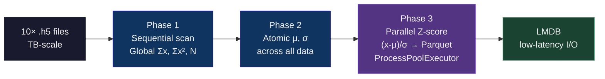

<div align="center">

# Aircraft turbine Digital Twin: Predictive Maintenance in Real Time

### *Make Bayesian CNN Research Code Face the EU AI Act*

by safely training ML in GCP using Docker on HPC 32 core instance with full Logs observability. 

Put it in a **real time telemetry** pipeline that **predicts RUL** (Remaining Useful Life) of the aircraft.

BUT you are **not allowed** to edit a single line of the original researcher code.

<br/>

<!-- ═══════════════════════ COMPLIANCE BADGES ═══════════════════════ -->


<br/>
<br/>

<!-- ═══════════════════════ TECH STACK ═══════════════════════ -->


<br/>

<b>
<a href="#-the-challenge">Challenge</a> ·
<a href="#-the-solution-adaptive-shim-architecture">Architecture</a> ·
<a href="#-system-architecture-4-node-lifecycle">Pipeline</a> ·
<a href="#-full-architecture-map">Full Map</a> ·
<a href="#-the-bayesian-engine">Bayesian Engine</a> ·
<a href="#-the-shim-layer-in-detail">Shim Layer</a> ·
<a href="#-repository-structure">Structure</a> ·
<a href="#-quick-start">Quick Start</a> ·
<a href="#-model-training-benchmarks">Benchmarks</a> ·
<a href="#-compliance--audit-trail">Compliance</a> ·
<a href="#-iam--least-privilege">IAM</a> ·
<a href="#-vs-original-research-code">vs Research</a>
</b>

</div>

<br/>

---

> ***Legenda*** Ok, company wants me to use their researcher code and build a **MLOps pipeline** from scratch. And train **ML** on **CPU** in **GCP**. But original code is written for **CUDA** and **local GPU's**. And there will be some **compliance audit** on it, so I need to implement **logs transparency**, add **Sigstore**, replace insecure .ckpt with **SafeTensors**. 

---

<br>

## 🎯 The Challenge

<div align="center">
<table>
<tr>
<td width="50%" align="center">

### 🔬 What the Researcher Gave Me

**Brilliant Bayesian algorithm.**

**But: no provenance. No audit trail. No safety.**

**It won't survive a critical infrastructure compliance audit.**

</td>
<td width="50%" align="center">

### 🏭 What Had to Be Built

| Requirement | Implementation |
|---|---|
| 🔐 Zero RCE vectors | pickle → SafeTensors |
| ✍️ Tamper-proof weights | Sigstore/Cosign keyless signing |
| 📋 Audit trail | provenance.json birth certificate |
| 🖥️ CPU-only deployment | CUDA lobotomy via metaclass shim |
| 📊 Full observability | Serial console tee → Cloud Logging |
| 🛑 Fail-closed | Crash → preserve evidence → GCS |

</td>
</tr>
</table>
</div>

<br>

## 🏗️ Architecture


<br>

## 📉 Dashboard


<br>

## 🔬 The Bayesian Engine

### Why Bayesian?

A frequentist model says: *"Engine #7 has 42 cycles left."*  
A Bayesian model says: *"Engine #7 has 42 ± 8 cycles left. I'm 68% confident."*

When the engine enters an unknown flight regime (high-G maneuvers, unusual temperature profiles), the Bayesian uncertainty **spikes**. The maintenance crew is alerted: *"We don't know — check it."* This is the difference between a false sense of security and a genuine safety system.

### Model: BigCeption

| Component | Specification |
|---|---|
| Architecture | Bayesian InceptionNet (Conv1D + Dense Variational layers) |
| Inference Method | **Flipout** Variational Inference (8 particles) |
| Prior | Gaussian Mean-Field + **Radial** (multi-modal) |
| Input Window | 30 time-steps × 14 sensors (X_s) + 4 auxiliary (A) |
| Output | RUL (cycles) + σ (epistemic uncertainty) |
| Activation | Softplus (physical positivity: RUL ≥ 0) |
| Loss | ELBO normalized: 1/(dataset × window × features) |
| Scoring | NASA Asymmetric Penalty: 1/5 (underest.) vs 1/13 (overest.) |

### Global Z-Score Standardization



<br>

## 🛡️ The Shim Layer In Detail

The Adaptive Shim intercepts vendor code at **five surgical points**:

| # | Interception Point | Method | Why |
|---|---|---|---|
| 1 | `torch.device("cuda:0")` | Metaclass `__new__` interception | Forces CPU-only: no CUDA runtime crashes on HPC |
| 2 | `pl.Trainer(gpus=...)` | Monkeypatch `__init__` | Redirects `accelerator='cpu'`, strips GPU kwargs |
| 3 | `ClippedAdam` → `Adam` | `sys.modules` redirection | Vendor wraps Adam; we unwrap for stability |
| 4 | `particles=1 → 8`, `q_scale=0.004 → 0.01` | Config override in `MASTER_CONFIG_MAP` | Research defaults are weak; industrial needs high-fidelity posteriors |
| 5 | `get_proportion_lists(device=...)` | Function-level patch | Forces CPU uncertainty quantification, prevents device mismatch |

<br>

## 📂 Repository Structure

```
n-cmapss-agentic-factory/
├── 📄 README.md                          ← YOU ARE HERE
├── 📄 pyproject.toml                     ← uv monorepo root (3 workspace members)
├── 📄 manifest.yaml                      ← project-wide metadata
│
├── 🧠 rul-model-factory/                 ← MLOps PIPELINE — BAYESIAN TRAINING
│   ├── pyproject.toml
│   ├── README.md
│   ├── artifacts/runs/                   ← signed & provenanced models
│   │   ├── rul_bayesian_20260420T0650Z_cpu_hpc/  (Standard, 3h)
│   │   └── rul_bayesian_20260421T1251Z_cpu_hpc/  (Deep Research, 18h)
│   └── src/rul_model_factory/
│       ├── cloud_trainer/
│       │   ├── execution_controller.py   ← State machine: train → sterilize → sign → upload
│       │   ├── core/
│       │   │   ├── vendor_patch_engine.py   ← THE SHIM: 5 monkeypatch points
│       │   │   ├── feature_engineering.py   ← HDF5 → Parquet/LMDB, GCS sync
│       │   │   └── parallel_execution.py    ← ProcessPoolExecutor workers
│       │   ├── security/
│       │   │   ├── artifact_sterilizer.py   ← pickle → SafeTensors
│       │   │   ├── cryptographic_signer.py  ← cosign sign-blob
│       │   │   └── provenance_generator.py  ← birth certificate JSON
│       │   └── logistics/
│       │       ├── path_resolver.py         ← SSOT filesystem mapping
│       │       └── artifact_uploader.py     ← GCS sync with signing gate
│       └── vendor/                      ← RESEARCH CODE (IMMUTABLE)
│           └── bayesrul/                ← github.com/arthurviens/bayesrul
│
├── 📡 streaming_pipeline/               ← STREAMING PIPELINE — REAL-TIME INFERENCE
│   ├── README.md
│   └── src/streaming_pipeline/
│       ├── ds02-006-preprocessing.py    ← Node 0: Parquet staging → local workspace
│       ├── producer.py                  ← Node 1: Fleet simulator → Redpanda
│       ├── consumer.py                  ← Node 2: Bayesian inference → DuckDB
│       ├── dashboard.py                 ← Node 3: Streamlit Sentinel dashboard
│       ├── models.py                    ← BigCeption architecture definition
│       └── config.py                    ← Pipeline configuration
│
├── 🏗️ infrastructure-setup/              ← INFRASTRUCTURE AS CODE
│   ├── terraform/
│   │   ├── live/_bootstrap/             ← GCS backend + state locking
│   │   ├── live/hpc-training-env/       ← KMS (90-day rotation) + IAM + project
│   │   └── modules/ephemeral-hpc-worker/ ← c2d-standard-32, pd-ssd, startup scripts
│   ├── docker/hpc-training-worker/      ← Dockerfile (non-root, Python 3.10-slim)
│   ├── docker/redpanda/                 ← docker-compose.yml for local streaming
│   ├── scripts/
│   │   ├── pipeline-orchestrator.sh     ← Full training: Terraform→Data→Docker→HPC→Harvest
│   │   ├── streaming-pipeline-orchestrator.sh ← Full streaming: Staging→Producer→Consumer→Dashboard
│   │   ├── worker-provisioning.sh       ← GCE instance dispatch
│   │   ├── image-build-publish.sh       ← Docker build + cosign sign
│   │   ├── artifact-synchronization.sh  ← GCS → local harvest with normalization
│   │   ├── data-lake-ingestion.sh       ← Raw HDF5 → GCS bucket
│   │   └── compliance-sync.sh           ← EU legal texts → workspace
│   └── src/infrastructure_setup/
│       ├── data_logistics/dataset_ingestion.py    ← NASA ZIP download + unzip
│       └── compliance_ops/dora_compliance_scraper.py ← DORA article scraper
│
├── 🗄️ dwh/dbt/                           ← DATA WAREHOUSE
│   ├── dbt_project.yml
│   ├── models/
│   │   ├── staging/stg_telemetry.sql     ← Raw → typed
│   │   ├── intermediate/int_telemetry_normalized.sql
│   │   ├── marts/fct_engine_health_per_cycle.sql  ← Fact table
│   │   └── marts/reports/               ← rpt_safety_alerts, rpt_engine_pnl
│   ├── macros/                          ← flight_distance, fuel_density, iso_corrections
│   └── seeds/fuel_prices.csv            ← Reference data
│
├── 📊 dashboard/                        ← Streamlit configuration
├── 📓 notebooks/                        ← Jupyter EDA & research notebooks
├── 📋 specs/                            ← API contracts, dataset dictionary, path specs
├── 🗺️ blueprints/                       ← Architecture Decision Records
└── 🔧 config/                           ← YAML configs: base, dev, prod, topics
```

<br>

## 🚀 Quick Start

### Local Streaming Pipeline

```bash
# One command: staging → streaming → inference → dashboard
./infrastructure-setup/scripts/streaming-pipeline-orchestrator.sh
```

| Node | Script | Role |
|---|---|---|
| 0 | `ds02-006-preprocessing.py` | Parquet staging from HDF5 |
| 1 | `producer.py` | Redpanda fleet simulator (multi-engine, time-warped) |
| 2 | `consumer.py` | Bayesian inference (30-cycle window, DuckDB sink) |
| 3 | `dashboard.py` | Streamlit Sentinel (RUL + uncertainty visualization) |

### Cloud Training (GCP HPC)

```bash
export GCP_PROJECT_ID="your-project"
export DATASET_ID="N-CMAPSS_DS02-006"

# Full cycle: Terraform → data → Docker → HPC → harvest
./infrastructure-setup/scripts/pipeline-orchestrator.sh

# Skip 18-minute preprocessing (reuse from previous run):
./infrastructure-setup/scripts/pipeline-orchestrator.sh -f bayesian-20260419-20df59
```

### Manual Artifact Recovery

```bash
./infrastructure-setup/scripts/artifact-synchronization.sh \
  "ncmapss-factory-worker-20260420-2206" \
  "runs/bayesian-20260420-0e405c"
```

<br>

## 🏆 Model Training Benchmarks

| Metric | Standard Run (3h) | Deep Research Run (18h) |
|---|---|---|
| **Artifact** | [20260420T0650Z](./rul-model-factory/artifacts/runs/rul_bayesian_20260420T0650Z_cpu_hpc) | [20260421T1251Z](./rul-model-factory/artifacts/runs/rul_bayesian_20260421T1251Z_cpu_hpc) |
| **Learning Rate** | `1e-4` | `3e-5` |
| **Bayesian Particles** | `1` | `8` |
| **Pretrain Epochs** | `10` | `25` |
| **Hardware** | c2d-standard-32 (AMD Milan) | c2d-standard-32 (AMD Milan) |


> The **Deep Research Run** provides significantly more stable uncertainty quantification due to 8-particle Flipout approximation. Default for high-risk diagnostic scenarios.

<br>

## 📋 Compliance & Audit Trail

### Per-Run Artifacts

```
artifacts/runs/rul_bayesian_YYYYMMDDTHHMMZ_cpu_hpc/
├── 📊 data/
│   └── *.data.parquet              ← predictions + metrics
├── 📝 logs/
│   └── *.training.events           ← TensorBoard events
├── 📋 metadata/
│   ├── provenance.json             ← BIRTH CERTIFICATE
│   └── *.hparams.yaml              ← hyperparameters
├── 🧠 model/
│   └── *.model.safetensors         ← SAFE weights (zero-RCE)
└── 🔐 security/
    ├── *.model.sig                  ← Cosign signature
    ├── *.model.cert                 ← Cosign certificate
    ├── provenance.json.sig         ← manifest signature
    └── provenance.json.cert        ← manifest certificate
```

### provenance.json

```json
{
  "factory_version": "V12.1.0",
  "audit_timestamp": "2026-04-14T11:22:00Z",
  "identity": {
    "run_name": "rul_bayesian_20260414T1122Z_cpu_hpc",
    "git_commit": "a1b2c3d4e5f6...",
    "instance_name": "ncmapss-factory-worker-20260414-1122"
  },
  "software_context": {
    "python": "3.10",
    "torch": "2.x",
    "pytorch_lightning": "2.x",
    "safetensors": "0.x"
  },
  "hardware_context": {
    "cpu_count": 32,
    "architecture": "AMD Milan"
  },
  "data_lineage": {
    "N-CMAPSS_DS02-006.h5": "sha256:abc123..."
  }
}
```

<br>

## 🔬 Aeronautical Feature Space

Per NASA N-CMAPSS specification:

| Category | Count | Sensor Names |
|---|---|---|
| **X_s** (Measurements) | 14 | T24, T30, T48, T50, P15, P2, P21, P24, Ps30, P40, Wf, Nf, Nc, BPR |
| **X_v** (Virtual) | 14 | Efficiencies, Flow Modifiers (derived from X_s) |
| **A** (Auxiliary) | 4 | Flight Condition (Fc), Health State (hs), altitude, Mach |
| **W** (Scenario) | 4 | alt, Mach, TRA, T2 — environmental context |

**Our model input:** `[X_s, A]` — 14 physical sensors + 4 auxiliary flight condition features.

**Validation strategy:** Unit-based splitting — entire engine lifecycles are held out, not random samples. This prevents data leakage between engines in the same fleet.

**Datasets used:**
- Training: `DS02-006` (primary), expandable to all 10 subsets
- Each `.h5` file contains multiple engine units with full run-to-failure trajectories
- Flight classes: 1 (short-haul), 2 (medium-haul), 3 (long-haul) — different degradation patterns

<br>

## 🛡️ TERRAFORM IAM & Least Privilege

| Service | IAM Role | Scope |
|---|---|---|
| **GCS Storage** | `roles/storage.objectAdmin` | Bucket-scoped (not project-wide) |
| **Cloud Logging** | `roles/logging.logWriter` | Write-only (no read access) |
| **Artifact Registry** | `roles/artifactregistry.reader` | Pull signed images only |
| **Compute Engine** | `roles/compute.instanceAdmin.v1` | Self-termination only |

All containers run as **non-root UID 1000**. The application logic never gains root. Docker builds use strict `.dockerignore` denying all by default.

<br>

## 📊 vs. Original Research Code

| Feature | `bayesrul` (Research) | This Factory (Industrial) |
|---|---|---|
| **Hardware** | Hardcoded `cuda:0` | Software-Defined (CPU/GPU via shim) |
| **Environment** | Local Conda/Pip | Hermetic Docker (immutable) |
| **Serialization** | `pickle` (.ckpt) | `SafeTensors` (.safetensors) |
| **Ingestion** | Sequential (single thread) | Parallel (ProcessPoolExecutor, 32-core) |
| **Scaling** | Mini-batch normalization | Global Z-Score (cross-fleet) |
| **Config** | Ephemeral CLI args | Audited Master Config (SSOT) |
| **Provenance** | None | Cryptographically signed manifest |
| **Uncertainty** | 1 particle MFVI | 8-particle Flipout + Radial |
| **Batch Safety** | Fixed 10,000 (OOM risk) | Dynamic cap @ 2,560 |
| **Validation** | Random split | Unit-based (engine-level isolation) |
| **Audit** | Print statements | Structured logs + serial console tee |

<br>

## 📝 License & Attribution

- **Factory code:** Apache 2.0 © 2026 Stan_Buren
- **bayesrul research code:** [github.com/arthurviens/bayesrul](https://github.com/arthurviens/bayesrul) — MIT License
- **NASA N-CMAPSS dataset:** Public domain (NASA Open Data) — [PHM Datasets](https://phm-datasets.s3.amazonaws.com/NASA/17.+Turbofan+Engine+Degradation+Simulation+Data+Set+.zip)

<br>

<p align="center">
  <sub>Every pickle purged. Every artifact signed. Every provenance manifest generated.</sub>
</p>

<p align="center">
  <sub>V12.1.0 · Stan_Buren · 2026</sub>
</p>
