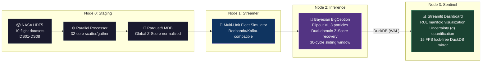
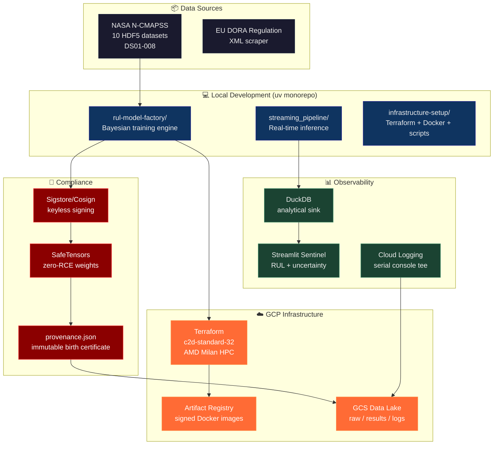
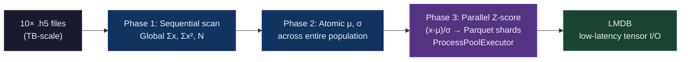

<p align="center">
  
  
  
  
</p>

# 🛡️ N-CMAPSS RUL MLOps Factory

### Make Bayesian CNN Research Code Face the EU AI Act

> **TL;DR:** A researcher wrote a Bayesian CNN for aircraft engine failure prediction. It works on his GPU. The company says "deploy this in production, but make it EU AI Act compliant, CPU-only, fully auditable, and don't edit the original research code." This repo is the answer.

---

<br>

## 🎯 The Challenge

<div align="center">
<table>
<tr>
<td width="50%" align="center">

### 🔬 What the researcher Gave me

**Brilliant Bayesian algorythm**
**But**
**No provenance. No audit trail. No safety.**
**It won't survive critical infrastructure compliance audit**

</td>
<td width="50%" align="center">

### 🏭 What need to be build?

<table>
<tr><td>🔐</td><td>No arbitrary code execution (pickle → SafeTensors)</td></tr>
<tr><td>✍️</td><td>Cryptographic signatures (Sigstore/cosign)</td></tr>
<tr><td>📋</td><td>Immutable provenance manifests</td></tr>
<tr><td>🖥️</td><td>CPU-only deployment (no CUDA lock-in)</td></tr>
<tr><td>📊</td><td>Full audit telemetry (every run, every artifact)</td></tr>
<tr><td>🛑</td><td>Fail-closed: crash & preserve evidence</td></tr>
</table>

</td>
</tr>
</table>
</div>

<br>

## 🧠 The Solution: Adaptive Shim Architecture

**We cannot edit the research code.** So we built a surgical interception layer — a **Shim** — that sits between the researcher's logic and the industrial runtime. The Shim monkeypatches CUDA calls, replaces insecure serialization, injects cryptographic signing, and enforces CPU-only execution — all without modifying a single line of `bayesrul`.


<br>

## 🏗️ System Architecture: 4-Node Lifecycle



<br>

## 🔐 Security: The Trilateral Protocol

Every model that leaves the factory passes through three mandatory gates:


<br>

## 📊 Full Architecture Map



<br>

## 🔬 The Bayesian Engine

### Why Bayesian?

A frequentist model says: *"Engine #7 has 42 cycles left."*  
A Bayesian model says: *"Engine #7 has 42 ± 8 cycles left. I'm 68% confident."*

When the engine enters an unknown flight regime (high-G maneuvers, unusual temperature profiles), the Bayesian uncertainty **spikes**. The maintenance crew is alerted: *"We don't know — check it."* This is the difference between a false sense of security and a genuine safety system.

### Model Architecture: BigCeption

<div align="center">
<table>
<tr><th>Component</th><th>Specification</th></tr>
<tr><td>Architecture</td><td>Bayesian InceptionNet (Conv1D + Dense Variational layers)</td></tr>
<tr><td>Inference Method</td><td><b>Flipout</b> Variational Inference (8 particles)</td></tr>
<tr><td>Prior</td><td>Gaussian Mean-Field + <b>Radial</b> (multi-modal)</td></tr>
<tr><td>Input Window</td><td>30 time-steps × 14 sensors (X_s) + auxiliary (A)</td></tr>
<tr><td>Output</td><td>RUL (cycles) + σ (epistemic uncertainty)</td></tr>
<tr><td>Activation</td><td>Softplus (physical positivity constraint: RUL ≥ 0)</td></tr>
<tr><td>Loss</td><td>ELBO normalized: 1/(dataset × window × features)</td></tr>
<tr><td>Scoring</td><td>NASA Asymmetric Penalty: 1/5 (underest.) vs 1/13 (overest.)</td></tr>
</table>
</div>

### Global Z-Score Standardization

Unlike batch normalization, we compute **global** mean and variance across ALL datasets before training. This ensures the model sees a unified feature space regardless of which engine is being evaluated — critical for cross-fleet generalization.



<br>

## 🛡️ The Shim Layer In Detail

The Adaptive Shim intercepts the vendor code at **five critical points**:

| # | Interception Point | Method | Why |
|---|---|---|---|
| 1 | `torch.device("cuda:0")` | Metaclass `__new__` interception | Forces CPU-only: no CUDA runtime crashes on HPC |
| 2 | `pl.Trainer(gpus=...)` | Monkeypatch `__init__` | Redirects `accelerator='cpu'`, strips GPU kwargs |
| 3 | `ClippedAdam` → `Adam` | `sys.modules` redirection | Vendor wraps Adam; we unwrap for stability |
| 4 | `particles=1 → 8`, `q_scale=0.004 → 0.01` | Config override in `MASTER_CONFIG_MAP` | Research defaults are weak; industrial needs high-fidelity posteriors |
| 5 | `get_proportion_lists(device=...)` | Function-level patch | Forces CPU uncertainty quantification, prevents device mismatch |

<br>

## 📂 Repository Structure

```
n-cmapss-agentic-factory/
├── 📄 README.md                          ← YOU ARE HERE
├── 📄 pyproject.toml                     ← uv monorepo root
├── 📄 manifest.yaml                      ← project-wide metadata
│
├── 🧠 rul-model-factory/                 ← BAYESIAN TRAINING ENGINE
│   ├── pyproject.toml
│   ├── README.md                         ← model training docs
│   └── src/rul_model_factory/
│       ├── cloud_trainer/
│       │   ├── execution_controller.py   ← main entry: state machine
│       │   ├── core/
│       │   │   ├── vendor_patch_engine.py   ← THE SHIM (monkeypatches)
│       │   │   ├── feature_engineering.py   ← data prep + GCS sync
│       │   │   └── parallel_execution.py    ← ProcessPoolExecutor workers
│       │   ├── security/
│       │   │   ├── artifact_sterilizer.py   ← pickle → SafeTensors
│       │   │   ├── cryptographic_signer.py  ← cosign sign-blob
│       │   │   └── provenance_generator.py  ← model birth certificate
│       │   └── logistics/
│       │       ├── path_resolver.py         ← SSOT filesystem map
│       │       └── artifact_uploader.py     ← GCS sync + signing
│       └── vendor/                      ← research code (IMMUTABLE)
│           └── bayesrul/                ← arthurviens/bayesrul
│
├── 📡 streaming_pipeline/               ← REAL-TIME INFERENCE
│   ├── README.md
│   └── src/streaming_pipeline/
│       ├── ds02-006-preprocessing.py    ← Node 0: data staging
│       ├── producer.py                  ← Node 1: fleet simulator
│       ├── consumer.py                  ← Node 2: Bayesian inference
│       ├── dashboard.py                 ← Node 3: Streamlit sentinel
│       └── models.py                    ← BigCeption architecture
│
├── 🏗️ infrastructure-setup/              ← IAC + ORCHESTRATION
│   ├── terraform/
│   │   ├── live/_bootstrap/             ← GCS backend (state locking)
│   │   ├── live/hpc-training-env/       ← KMS + IAM + project setup
│   │   └── modules/ephemeral-hpc-worker/ ← c2d-standard-32 template
│   ├── docker/hpc-training-worker/      ← Dockerfile + requirements
│   ├── scripts/
│   │   ├── pipeline-orchestrator.sh     ← full training cycle
│   │   ├── streaming-pipeline-orchestrator.sh ← streaming cycle
│   │   ├── worker-provisioning.sh       ← GCE instance dispatch
│   │   ├── image-build-publish.sh       ← Docker build + cosign sign
│   │   ├── artifact-synchronization.sh  ← GCS → local harvest
│   │   └── data-lake-ingestion.sh       ← raw data → GCS
│   └── src/infrastructure_setup/
│       ├── data_logistics/              ← dataset download + unzip
│       └── compliance_ops/              ← DORA regulation scraper
│
├── 📊 dashboard/                        ← Streamlit config
├── 🗄️ dwh/dbt/                           ← dbt dimensional models
├── 📓 notebooks/                        ← EDA + research
├── 📋 specs/                            ← API contracts + schemas
├── 🗺️ blueprints/                       ← architecture decisions
└── 🔧 config/                           ← YAML configs (dev/prod/topics)
```

<br>

## 🚀 Quick Start

### Full Streaming Pipeline (Local)

```bash
# One command: staging → streaming → inference → dashboard
./infrastructure-setup/scripts/streaming-pipeline-orchestrator.sh
```

This launches:
1. **Node 0** — Parquet staging from HDF5
2. **Node 1** — Redpanda fleet simulator (multi-engine, time-warped)
3. **Node 2** — Bayesian inference consumer (30-cycle sliding window)
4. **Node 3** — Streamlit dashboard (RUL + uncertainty visualization)

### Cloud Training (GCP HPC)

```bash
export GCP_PROJECT_ID="your-project"
export DATASET_ID="N-CMAPSS_DS02-006"

# Full cycle: Terraform → data → Docker → HPC → harvest
./infrastructure-setup/scripts/pipeline-orchestrator.sh

# Skip preprocessing (reuse from previous run):
./infrastructure-setup/scripts/pipeline-orchestrator.sh -f bayesian-20260419-20df59
```

### Manual Artifact Recovery

If the orchestrator crashes after training but before sync:

```bash
./infrastructure-setup/scripts/artifact-synchronization.sh \
  "ncmapss-factory-worker-20260420-2206" \
  "runs/bayesian-20260420-0e405c"
```

<br>

## 🏆 Model Training Benchmarks

| Metric | Standard Run (3h) | Deep Research Run (18h) |
|---|---|---|
| **Artifact** | [20260420T0650Z](./rul-model-factory/artifacts/runs/rul_bayesian_20260420T0650Z_cpu_hpc) | [20260421T1251Z](./rul-model-factory/artifacts/runs/rul_bayesian_20260421T1251Z_cpu_hpc) |
| **Learning Rate** | `1e-4` | `3e-5` (High Precision) |
| **Bayesian Particles** | `1` | `8` (Enhanced Posterior) |
| **Pretrain Epochs** | `10` | `25` |
| **Hardware** | c2d-standard-32 (AMD Milan) | c2d-standard-32 (AMD Milan) |

> **The Deep Research Run** provides significantly more stable uncertainty quantification due to 8-particle Flipout approximation. Default for high-risk diagnostic scenarios.

<br>

## 📋 Compliance & Audit Trail

### Per-Run Artifacts

Every training cycle produces:

```
artifacts/runs/rul_bayesian_YYYYMMDDTHHMMZ_cpu_hpc/
├── 📊 data/
│   └── *.data.parquet              ← predictions + metrics
├── 📝 logs/
│   └── *.training.events           ← TensorBoard events
├── 📋 metadata/
│   ├── provenance.json             ← BIRTH CERTIFICATE
│   └── *.hparams.yaml              ← hyperparameters
├── 🧠 model/
│   └── *.model.safetensors         ← SAFE weights (no pickle)
└── 🔐 security/
    ├── *.model.sig                  ← Cosign signature
    ├── *.model.cert                 ← Cosign certificate
    ├── provenance.json.sig         ← manifest signature
    └── provenance.json.cert        ← manifest certificate
```

### provenance.json — The Birth Certificate

```json
{
  "factory_version": "V12.1.0",
  "audit_timestamp": "2026-04-14T11:22:00Z",
  "identity": {
    "run_name": "rul_bayesian_20260414T1122Z_cpu_hpc",
    "git_commit": "a1b2c3d4e5f6...",
    "instance_name": "ncmapss-factory-worker-20260414-1122"
  },
  "software_context": {
    "python": "3.10",
    "torch": "2.x",
    "pytorch_lightning": "2.x",
    "safetensors": "0.x"
  },
  "hardware_context": {
    "cpu_count": 32,
    "architecture": "AMD Milan"
  },
  "data_lineage": {
    "N-CMAPSS_DS02-006.h5": "sha256:abc123..."
  }
}
```

<br>

## 🔬 Aeronautical Feature Space

Per NASA N-CMAPSS specification:

| Category | Count | Features |
|---|---|---|
| **X_s** (Measurements) | 14 | T24, T30, T48, T50, P15, P2, P21, P24, Ps30, P40, Wf, Nf, Nc, BPR |
| **X_v** (Virtual) | 14 | Efficiencies, Flow Modifiers (derived from X_s) |
| **A** (Auxiliary) | 4 | Flight Condition (Fc), Health State (hs), altitude, Mach |
| **W** (Scenario) | 4 | alt, Mach, TRA, T2 — environmental context |

**Our model uses:** `[X_s, A]` — 14 physical sensors + auxiliary flight data.

**Validation strategy:** Unit-based splitting (entire engine lifecycles held out), not random shuffling. This prevents data leakage between engines.

<br>

## 🛡️ IAM & Least Privilege

| Service | IAM Role | Scope |
|---|---|---|
| **GCS Storage** | `roles/storage.objectAdmin` | Bucket-scoped (not project-wide) |
| **Cloud Logging** | `roles/logging.logWriter` | Write-only (no read access) |
| **Artifact Registry** | `roles/artifactregistry.reader` | Pull signed images only |
| **Compute Engine** | `roles/compute.instanceAdmin.v1` | Self-termination only |

All containers run as **non-root UID 1000**. The application never gains root.

<br>

## 🧰 Technology Stack

<div align="center">
<table>
<tr>
<td width="33%" align="center">

### 🧠 AI/ML
- PyTorch 2.x
- PyTorch Lightning
- Bayesian VI (Flipout)
- SafeTensors
- NVIDIA CUDA → CPU shim

</td>
<td width="33%" align="center">

### 📡 Streaming
- Redpanda (Kafka-compatible)
- DuckDB (analytical sink)
- PySpark Structured Streaming
- Parquet + Hive partitioning

</td>
<td width="33%" align="center">

### 🏗️ Infrastructure
- Terraform (IaC)
- GCP Compute Engine (c2d-standard-32)
- Docker (non-root)
- Artifact Registry
- Cloud Storage (GCS)

</td>
</tr>
<tr>
<td align="center">

### 🔐 Security
- Sigstore/Cosign (keyless signing)
- SafeTensors (zero-RCE)
- provenance.json (immutable)
- KMS key rotation (90-day)

</td>
<td align="center">

### 📊 Observability
- Streamlit dashboard
- TensorBoard
- Cloud Logging (serial tee)
- DuckDB point-in-time snapshots

</td>
<td align="center">

### 🛠️ Dev Tools
- uv (monorepo manager)
- Python 3.10+
- Hatchling build system
- GitHub Actions CI/CD

</td>
</tr>
</table>
</div>

<br>

## 📊 vs. Original Research Code

| Feature | `bayesrul` (Research) | This Factory (Industrial) |
|---|---|---|
| **Hardware** | Hardcoded `cuda:0` | Software-Defined (CPU/GPU via shim) |
| **Environment** | Local Conda/Pip | Hermetic Docker (immutable) |
| **Serialization** | `pickle` (.ckpt) | `SafeTensors` (.safetensors) |
| **Ingestion** | Sequential (single thread) | Parallel (ProcessPoolExecutor, 32-core) |
| **Scaling** | Mini-batch normalization | Global Z-Score (cross-fleet) |
| **Config** | Ephemeral CLI args | Audited Master Config (SSOT) |
| **Provenance** | None | Cryptographically signed manifest |
| **Uncertainty** | 1 particle MFVI | 8-particle Flipout + Radial |
| **Batch Safety** | Fixed 10,000 (OOM risk) | Dynamic cap @ 2,560 |
| **Validation** | Random split | Unit-based (engine-level isolation) |
| **Audit** | Print statements | Structured logs + serial console tee |

<br>

## 🗺️ Technical Roadmap

| Phase | Task | Status |
|---|---|---|
| **Config** | Move `MASTER_CONFIG_MAP` to `config/golden_bayesian.yaml` | 📋 Backlog |
| **Provenance** | SHA-256 deep verification in artifact sync | 📋 Backlog |
| **IAM** | Custom self-deletion role (no `instanceAdmin` wildcard) | 📋 Backlog |
| **Network** | Private subnet + Cloud NAT (remove public IPs) | 📋 Backlog |
| **Scaling** | Terragrunt for multi-env (Dev/Staging/Prod) | 📋 Backlog |
| **Logistics** | Marker-based root discovery (replace `parents[5]`) | 📋 Backlog |
| **Sterilization** | Support legacy `.pt` artifacts in sterilizer | 📋 Backlog |
| **Normalization** | Dynamic Z-score from YAML metadata (inference parity) | 📋 Backlog |

<br>

## 📝 License & Attribution

- **Factory code:** Apache 2.0 © 2026 Stan_Buren
- **bayesrul research code:** [github.com/arthurviens/bayesrul](https://github.com/arthurviens/bayesrul) — MIT License
- **NASA N-CMAPSS dataset:** Public domain (NASA Open Data)

<br>

<p align="center">
  <sub>Built with obsessive attention to detail. Every pickle purged, every artifact signed, every provenance manifest generated.</sub>
</p>

<p align="center">
  <sub>V12.1.0 | Stan_Buren | 2026</sub>
</p>
